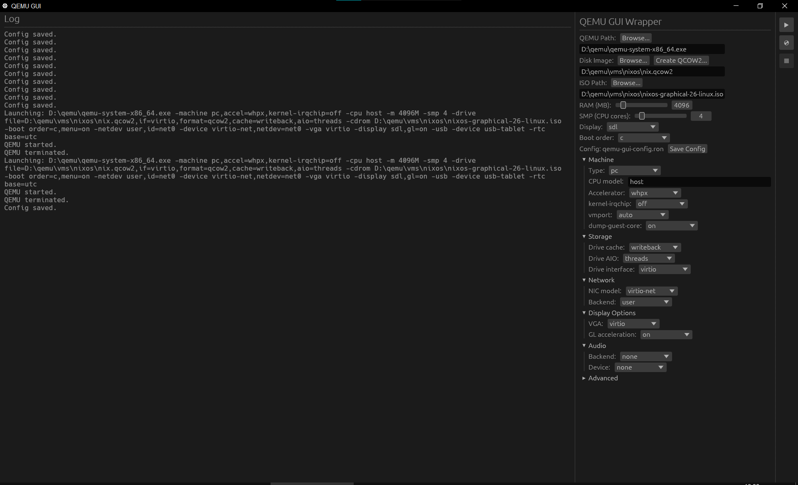

# QEMU GUI

[](https://github.com/SUDOER1337/qemu-egui/actions/workflows/rust.yml)

A minimal portable Rust Egui wrapper for QEMU — runs on Linux and Windows.

## Showcase



## Roadmap
[] sessions

## Prerequisites

### Linux
- **QEMU** with KVM: `qemu-system-x86_64` (install via your package manager)
- **Rust** toolchain (auto-pinned via `rust-toolchain.toml`):
  - `rustup install stable`
- **mold** linker (optional but configured): `paru -S mold` (Arch) or equivalent

### Windows
- **QEMU** installed and accessible at the configured path (e.g. `D:\qemu\qemu-system-x86_64.exe`)
- **Rust** toolchain (auto-pinned via `rust-toolchain.toml`):
  - Channel: `stable`
  - Fast linker `rust-lld.exe` pre-configured in `.cargo/config.toml`

#### Optional: faster re-builds with sccache

```sh
# Install sccache (one of these):
# winget install Mozilla.sccache   (Windows)
# paru -S sccache                  (Arch Linux)

# Then in your shell before running cargo:
# Linux:
export RUSTC_WRAPPER=sccache
# Windows:
$env:RUSTC_WRAPPER = "sccache"
```

## Build & Run

```sh
cargo run         # build and launch
cargo check       # fast compile check (no linking)
cargo clippy      # lint
cargo fmt         # format
```

Or with `just`:

```sh
just run          # cargo run
just check        # cargo check
just fix          # clippy + fmt
```

## Nix

A flake is included for reproducible Linux builds and a fully-provisioned dev shell.

```sh
nix develop                  # rustc, cargo, clippy, rust-analyzer, just, sccache, mold, qemu
nix build                    # packaged binary -> ./result/bin/qemu-egui
nix run                      # build and launch
nix flake check              # build + clippy --deny warnings + tests
nix fmt                      # format the nix files
```

`nix develop` sets `RUSTC_WRAPPER=sccache` and puts the wgpu/X11/GL libraries on
`LD_LIBRARY_PATH` for the dev build.

The packaging build strips `.cargo/config.toml` and `tools/` from the source tree
(`nix/package.nix:49`), since those hardcode the Windows `rust-lld` wrapper and
`-fuse-ld=mold`, neither of which exist in the sandbox.

Notes:
- `flake.nix` packages Linux only; Windows still builds through `just` / `cargo`.
- Building the flake needs the `flake.nix`, `nix/`, and `flake.lock` files to be
  git-tracked (Nix reads the git tree, not the working directory).

## Usage

1. Configure paths to QEMU binary, disk image, and ISO
2. Set accelerator to **kvm** (Linux) or **whpx** (Windows)
3. Click **Boot from Disk** or **Install (Boot from ISO)**
4. Use **Kill QEMU** to stop the VM
5. Config is auto-saved on exit or via **Save Config**

Config is persisted as `qemu-gui-config.ron` next to the binary.

## Stack

- [egui](https://github.com/emilk/egui) / eframe 0.34 (wgpu)
- serde + RON 0.8 for config persistence
- Rust 2021 edition
